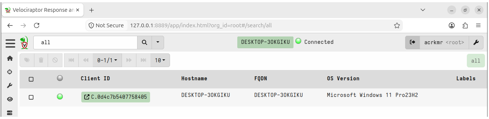
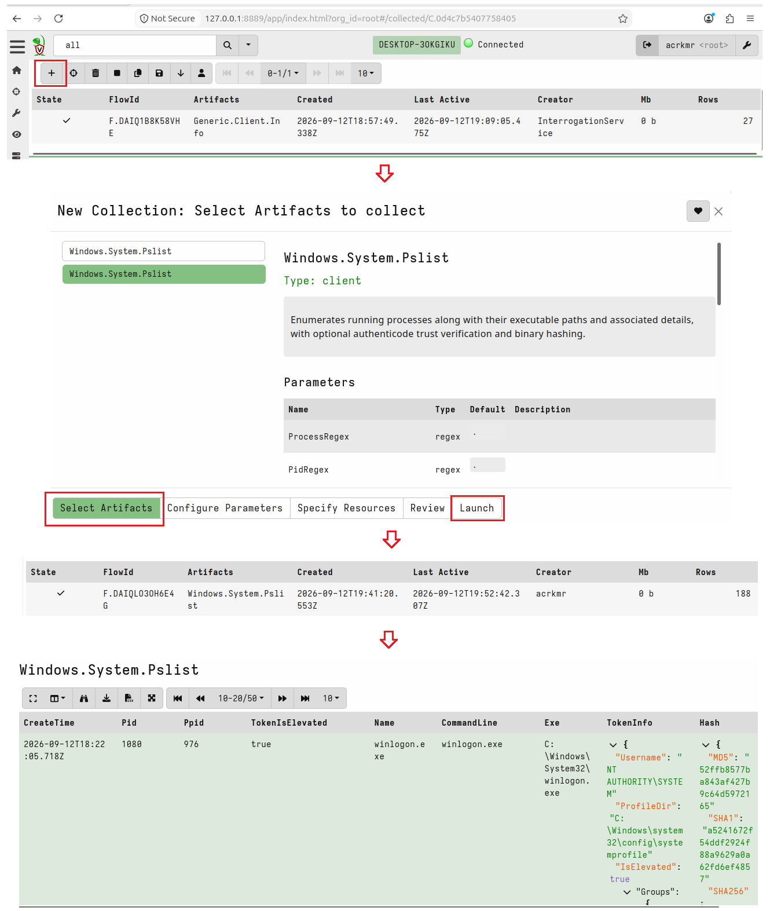
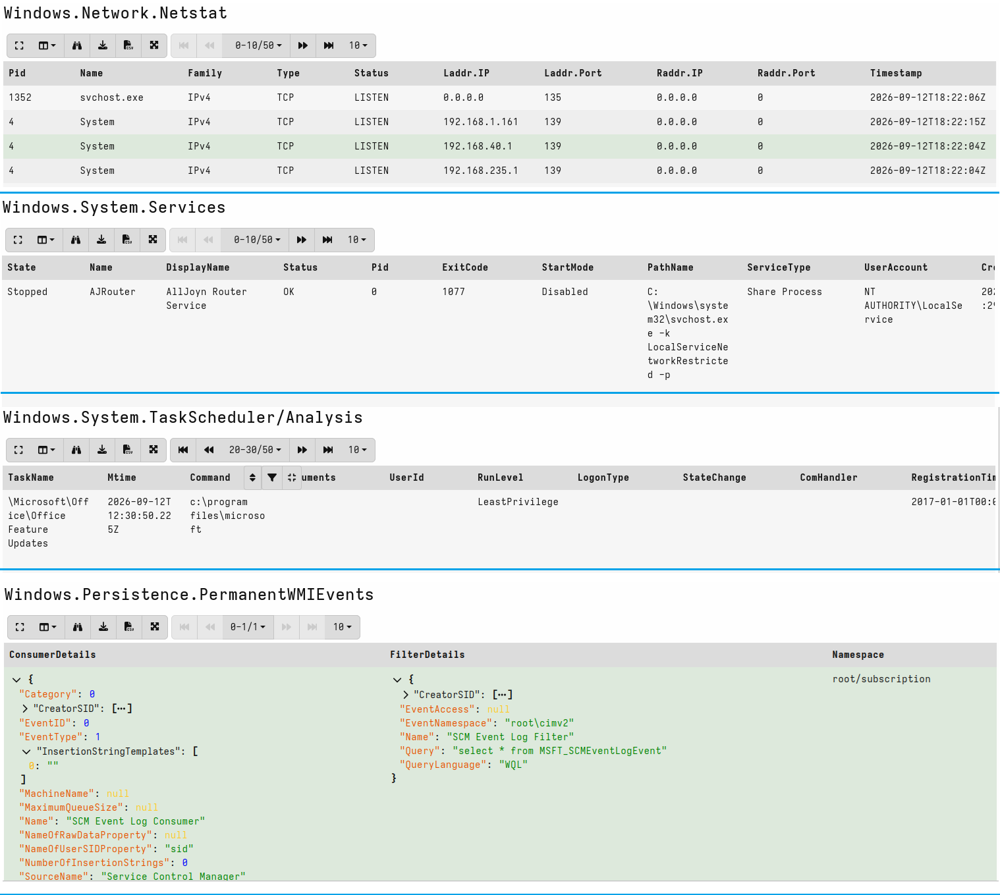

# Phase 1 - Server Deployment and Endpoint Enrollment

## Overview

This phase covers:
- Configuring networking so the server and client can communicate
- Installing Velociraptor on Ubuntu and generating the server config
- Running the server as a persistent service
- Deploying the Windows client
- Running the first triage collection and capturing a clean baseline

---

## Lab Topology

<pre>
Host Machine (Windows)
    |
    └── VirtualBox
            |
            └── Ubuntu Server 22.04 VM (Velociraptor Server)
                    IP: 192.168.100.3

Velociraptor Client: Windows host machine
</pre>

---

## Prerequisites

- VirtualBox installed on your Windows machine
- Ubuntu Server 22.04 LTS running as a VM
- Internet connection on the host machine

---

## Step 1 - Configure Networking

By default, VirtualBox assigns VMs a NAT IP (`10.0.2.15`) that isolates them from the host machine. We need to create a dedicated NAT Network called `labnet` that gives the Ubuntu VM a reachable IP, and forward the Velociraptor frontend port to the Windows host so the client can connect.

> **Note:** The GUI stays inside the Ubuntu VM and is accessed from the Ubuntu browser only. This mirrors a real IR deployment where the analyst GUI is never exposed directly to endpoints.

> **Note:** Shut down the Ubuntu VM before running these commands.

On your Windows host, open PowerShell as Administrator:

```powershell
$vbm = "C:\Program Files\Oracle\VirtualBox\VBoxManage.exe"

# Create labnet
& $vbm natnetwork add --netname labnet --network 192.168.100.0/24 --enable --dhcp on

# Assign the Velociraptor VM to labnet
& $vbm modifyvm "Velociraptor" --nic1 natnetwork --nat-network1 labnet

# Forward only the frontend port - GUI stays inside the Ubuntu VM
& $vbm natnetwork modify --netname labnet --port-forward-4 "frontend:tcp:[]:8000:[192.168.100.3]:8000"

# Confirm
& $vbm natnetwork list
```

Expected output:

```
Name:         labnet
Enabled:      Yes
Network:      192.168.100.0/24
Gateway:      192.168.100.1
DHCP Server:  Yes
Port-forwarding (ipv4)
        frontend:tcp:[]:8000:[192.168.100.3]:8000
```

---

## Step 2 - Verify Server IP

Boot the Ubuntu VM and confirm the IP address:

```bash
ip addr show | grep "inet " | grep -v 127.0.0.1
```

Expected output:

```
inet 192.168.100.3/24 brd 192.168.100.255 scope global dynamic noprefixroute enp0s3
```


> **Note:** Your IP may differ slightly - it will be somewhere in the `192.168.100.0/24` range. Note it down, you will need it when generating the server config in Step 4.

---

## Step 3 - Install Velociraptor

Create the working directory:

```bash
sudo mkdir -p /opt/velociraptor
cd /opt/velociraptor
```

Update the package list and install wget:

```bash
sudo apt update && sudo apt install -y wget
```

Download the Velociraptor binary. Always check the latest release at `https://github.com/Velocidex/velociraptor/releases`, then download:

```bash
wget https://github.com/Velocidex/velociraptor/releases/download/v0.77.2/velociraptor-v0.77.2-linux-amd64 -O velociraptor
```

Make it executable and move to PATH:

```bash
chmod +x velociraptor
sudo mv velociraptor /usr/local/bin/velociraptor
```

Verify the installation:

```bash
velociraptor version
```

Expected output:

```
name: velociraptor
version: 0.77.2
commit: c0c9dd609
build_time: "2026-08-10T00:58:52Z"
compiler: go1.25.3
system: linux
architecture: amd64
```


> **Note:** Always match the binary version between server and client. Mismatched versions cause silent connection failures during client enrollment.

---

## Step 4 - Generate the Server Config

Run the interactive config wizard:

```bash
cd /opt/velociraptor
sudo velociraptor config generate -i
```

Answer the prompts as follows:

| Prompt | Answer |
|---|---|
| OS | Linux |
| Datastore path | `/opt/velociraptor/datastore` |
| Frontend port | `8000` |
| GUI port | `8889` |
| SSL type | Self Signed SSL |
| DNS type | None - Configure DNS manually |
| Public DNS/IP | `192.168.100.3` (your VM IP from Step 2) |
| Use registry for client writeback | No |
| Username | your choice |
| Password | your choice |


> **Note:** When the wizard asks for the public DNS/IP, enter the VM IP you confirmed in Step 2 - not `localhost` and not the old NAT IP `10.0.2.15`. Getting this wrong means clients will never be able to connect.

The wizard generates `server.config.yaml` in `/opt/velociraptor/`. Generate the client config separately:

```bash
sudo bash -c 'velociraptor --config /opt/velociraptor/server.config.yaml config client > /opt/velociraptor/client.config.yaml'
```

Confirm both files exist:

```bash
sudo ls -lh /opt/velociraptor/
```

Expected output:

```
-rw-r--r-- 1 root root 2.7K client.config.yaml
-rw------- 1 root root  13K server.config.yaml
```


---

## Step 5 - Test the Server

Run the server in test mode first to confirm it starts cleanly:

```bash
sudo velociraptor --config /opt/velociraptor/server.config.yaml frontend -v
```

Look for these two lines before proceeding:

```
[INFO] GUI is ready to handle TLS requests on https://127.0.0.1:8889/
[INFO] Frontend is ready to handle client TLS requests at https://192.168.100.3:8000/
```


> **Note:** The GUI is bound to `127.0.0.1` only - this is intentional. It means the GUI is only accessible from inside the Ubuntu VM browser, not from the Windows host. This mirrors a real IR deployment where the analyst interface is never exposed directly to endpoints.

Once confirmed, press `Ctrl+C` to stop the server and proceed to Step 6.

---

## Step 6 - Run Velociraptor as a systemd Service

The test run confirmed the server starts cleanly. Now set it up as a persistent service so it survives reboots and runs automatically.

Create the service file:

```bash
sudo nano /etc/systemd/system/velociraptor.service
```

Paste exactly this:

```ini
[Unit]
Description=Velociraptor IR Server
After=network.target

[Service]
Type=simple
User=root
ExecStart=/usr/local/bin/velociraptor \
  --config /opt/velociraptor/server.config.yaml \
  frontend -v
Restart=on-failure
RestartSec=5
StandardOutput=journal
StandardError=journal

[Install]
WantedBy=multi-user.target
```

Save with `Ctrl+O`, exit with `Ctrl+X`.

Enable and start the service:

```bash
sudo systemctl daemon-reload
sudo systemctl enable velociraptor
sudo systemctl start velociraptor
sudo systemctl status velociraptor
```

Expected output:

```
● velociraptor.service - Velociraptor IR Server
     Active: active (running)
```


---

## Step 7 - Access the GUI

Open a browser inside the Ubuntu VM and navigate to:

```
https://127.0.0.1:8889
```

You will see a certificate warning - this is expected since we are using a self-signed certificate. Click **Advanced** and proceed.

Log in with the credentials you set during the config wizard.


> **Note:** The GUI is only accessible from inside the Ubuntu VM. This is intentional - in a real IR deployment the analyst interface is never exposed directly to endpoints or the public internet.

---

## A Note on Real IR Deployments

In this lab, the Velociraptor server runs inside a VirtualBox VM accessible only on the local network. In a real IR engagement the setup is different but the workflow is identical.

<pre>
Internet
    |
    ├── Endpoint (any location)
    ├── Endpoint (any location)
    └── Endpoint (any location)
            |
            └── All connect to ──► Velociraptor Server
                                   (Cloud VM with public IP)
                                   Analyst accesses GUI
                                   over VPN or SSH tunnel
</pre>

The server runs on a cloud instance (AWS, Azure, GCP) with a real public IP. The client config has that public IP baked in. When the client is installed on any endpoint anywhere in the world it phones home to the server over port 8000.

For remote helpline scenarios - where an individual contacts you suspecting compromise - the analyst sends a pre-packaged collector: a single executable with the client config already embedded. The person runs it with one double-click. Their device appears in the GUI within seconds and live triage begins immediately, regardless of where in the world they are.

What we build in this lab mirrors that workflow exactly. VirtualBox NAT stands in for the internet. Everything else - the artifacts, the queries, the IR process - is the same.

---

## Step 8 - Deploy the Windows Client

The client needs two things on the Windows machine:
- The Velociraptor Windows executable
- The `client.config.yaml` generated in Step 4

### Transfer the Client Config to Windows

On the Ubuntu VM, serve the config file temporarily:

```bash
cd /opt/velociraptor
sudo python3 -m http.server 9999
```

On the Windows host, open PowerShell as Administrator and download the config:

```powershell
$vbm = "C:\Program Files\Oracle\VirtualBox\VBoxManage.exe"

# Add temporary port forward for file transfer
& $vbm natnetwork modify --netname labnet --port-forward-4 "fileserver:tcp:[]:9999:[192.168.100.3]:9999"

# Download the client config
Invoke-WebRequest `
  -Uri "http://127.0.0.1:9999/client.config.yaml" `
  -OutFile "C:\Users\$env:USERNAME\client.config.yaml"

# Confirm
Get-Item "C:\Users\$env:USERNAME\client.config.yaml"
```

Expected output:

```
Mode                 LastWriteTime         Length Name
----                 -------------         ------ ----
-a----        13-09-2026            2691   client.config.yaml
```

Stop the Python server on Ubuntu with `Ctrl+C`.

### Update the Server URL

The config currently points to `192.168.100.3:8000` - your Windows machine cannot reach that IP directly through the NAT network. Update it to `127.0.0.1` so the port forward routes it correctly.

```powershell
notepad "C:\Users\$env:USERNAME\client.config.yaml"
```

Find:

```yaml
Client:
  server_urls:
  - https://192.168.100.3:8000/
```

Change to:

```yaml
Client:
  server_urls:
  - https://127.0.0.1:8000/
```

Save and close. Confirm the change:

```powershell
Get-Content "C:\Users\$env:USERNAME\client.config.yaml" | Select-String "server_urls" -Context 0,1
```

Expected output:

```
  server_urls:
  - https://127.0.0.1:8000/
```

### Verify the Frontend Port Forward

Before installing the client, confirm port 8000 is reachable from Windows:

```powershell
$vbm = "C:\Program Files\Oracle\VirtualBox\VBoxManage.exe"

# Confirm frontend port forward exists
& $vbm natnetwork list
```

Expected output should include:

```
Port-forwarding (ipv4)
        frontend:tcp:[]:8000:[192.168.100.3]:8000
```

If the frontend forward is missing, add it:

```powershell
& $vbm natnetwork modify --netname labnet --port-forward-4 "frontend:tcp:[]:8000:[192.168.100.3]:8000"
```

Test connectivity:

```powershell
Test-NetConnection -ComputerName 127.0.0.1 -Port 8000
```

Expected output:

```
TcpTestSucceeded : True
```

> **Note:** If `TcpTestSucceeded` is False, the port forward is not active. Check that the Ubuntu VM is running and the Velociraptor service is up before proceeding.

### Download the Windows Executable

```powershell
Invoke-WebRequest `
  -Uri "https://github.com/Velocidex/velociraptor/releases/download/v0.77.2/velociraptor-v0.77.2-windows-amd64.exe" `
  -OutFile "C:\Users\$env:USERNAME\velociraptor.exe"

# Confirm
Get-Item "C:\Users\$env:USERNAME\velociraptor.exe"
```

Expected output:

```
Mode                 LastWriteTime         Length Name
----                 -------------         ------ ----
-a----        13-09-2026            70499832 velociraptor.exe
```

### Install as a Windows Service

Run PowerShell as Administrator:

```powershell
# Create the required directory
New-Item -ItemType Directory -Path "C:\Program Files\Velociraptor" -Force

# Move to the files directory
cd C:\Users\$env:USERNAME

# Install as service
.\velociraptor.exe --config client.config.yaml service install

# Verify
Get-Service -Name Velociraptor
```

Expected output:

```
Status   Name               DisplayName
------   ----               -----------
Running  Velociraptor       Velociraptor
```

> **Why install as a service and not run manually?** Running manually gives the client only your user's privileges. You will get `Access is denied` errors on protected system processes like `csrss.exe` and `wininit.exe`. Installed as a Windows service it runs as SYSTEM - full visibility across all processes, no access errors, and it survives reboots automatically.

Within 30 seconds of the service starting, open the Velociraptor GUI in the Ubuntu VM browser at `https://127.0.0.1:8889`. Your Windows machine should appear in the **Clients** tab.



## Run Baseline Collection

Enrollment confirmed. Now do the most important thing you can 
do before simulating any incident activity - capture what normal 
looks like.

In the GUI, click your enrolled client > **New Collection** > 
add these artifacts:

| Artifact | Why it matters |
|---|---|
| `Windows.System.Pslist` | Every running process, its parent, command line, and hash. Your first pivot during any investigation. |
| `Windows.Network.Netstat` | Every active connection. Normal outbound traffic on a clean machine is your baseline for detecting C2 beaconing later. |
| `Windows.System.Services` | Attackers persist via services. Knowing what's installed clean means any new entry post-compromise stands out immediately. |
| `Windows.System.TaskScheduler` | Same logic as services - scheduled tasks are a common persistence mechanism. |
| `Windows.Persistence.PermanentWMIEvents` | WMI subscriptions are invisible to most users and survive reboots. Empty on a clean machine is the expected result. |

Click **Launch**. Wait for all green checkmarks.



This collection is not just a setup step. It is the reference 
point for everything that follows. When Phase 3 hunts fire on 
a new process, a new service, or a new scheduled task - this 
baseline is what you compare against. The delta is your signal.

---

### Take a Snapshot

VirtualBox > Velociraptor VM > right-click > Take Snapshot
Name: Phase1-Complete-Baseline


Revert here any time the lab breaks. This is your known-good 
restore point for all subsequent phases.

