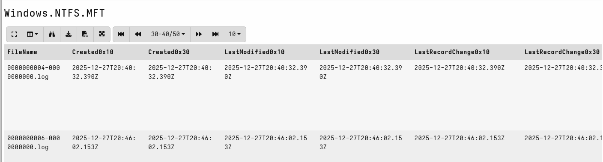
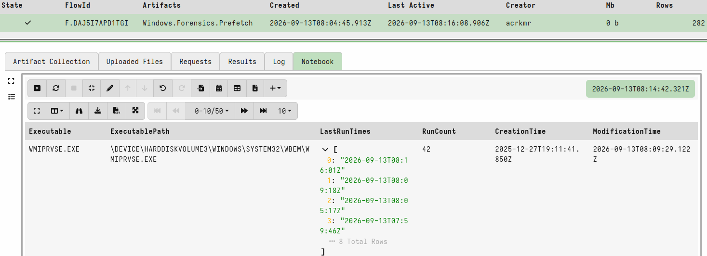
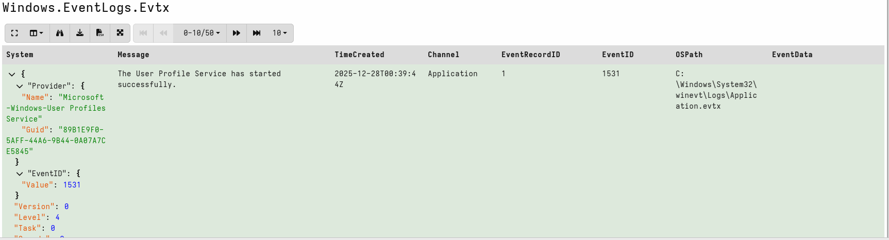

# Phase 2 - Forensic Artifact Collection

## Overview

This phase covers forensic artifact collection across five 
categories - the evidence sources that tell the full story of 
what happened on an endpoint during an incident.

```
1. MFT      - filesystem record, every file ever on the volume
2. Prefetch - execution history, what ran and when
3. EVTX     - Windows event logs
4. Registry - persistence, user activity, system configuration
5. Memory   - running state, injected code, decrypted strings
```

Phase 2 establishes the collection capability before any 
simulated compromise. You need to know how to pull these 
artifacts cleanly before you have something interesting to 
look at.

---

## Scenario

### Scenario A - Phishing to Persistence to Lateral Movement

Full kill chain simulated across Phase 2 and Phase 3:

```
1. Phishing email arrives
2. User opens malicious Office document
3. Macro drops payload to disk
4. Payload establishes persistence via scheduled task
5. Beacons to C2
6. Lateral movement attempt via PsExec/WMI
```

### Scenario B - Helpline/Targeted Surveillance

Covered in a later phase - triage collection with full audit 
trail, consent documentation, and stalkerware/spyware indicators.

---

## Prerequisites

```
- Phase 1 complete - server running, physical machine enrolled
- FlareVM added to labnet (192.168.100.4)
- Velociraptor client deployed on FlareVM and running as SYSTEM
- FlareVM-Clean-Baseline snapshot taken
```

---

## Lab Topology

```
Host Machine (Windows) - 192.168.1.x
    |
    └── VirtualBox - labnet (192.168.100.0/24)
            |
            ├── Ubuntu 22.04 VM - Velociraptor Server
            │       IP: 192.168.100.3
            │       GUI: https://127.0.0.1:8889 (VM browser only)
            │
            └── ACR-FlareVM - Victim Machine
                    IP: 192.168.100.4
                    Role: Simulated compromised endpoint
                    Snapshot: FlareVM-Clean-Baseline
```

---

## FlareVM Setup

FlareVM was added to labnet and assigned `192.168.100.4` via 
DHCP. The Velociraptor client was deployed identically to the 
physical machine client in Phase 1.

```powershell
# Add FlareVM to labnet (run on Windows host, VM must be off)
$vbm = "C:\Program Files\Oracle\VirtualBox\VBoxManage.exe"
& $vbm modifyvm "ACR-FlareVM" --nic1 natnetwork --nat-network1 labnet
```


Once booted, the Velociraptor client was transferred from the 
Ubuntu VM via Python HTTP server, installed as a Windows service, 
and the VM appeared in the GUI within 30 seconds.

Baseline collection was run on FlareVM matching the Phase 1 
baseline artifact set. Clean snapshot taken before any 
simulated activity.

---

## Artifact 1 - MFT Collection

### What the MFT Is

Every file on an NTFS volume has a record in the Master File 
Table. Think of it as the filesystem's database - one record 
per file containing:

```
- Full file path
- File size
- Four timestamps from $STANDARD_INFORMATION:
    Created, Modified, Accessed, Changed
- Four timestamps from $FILE_NAME:
    Created, Modified, Accessed, Changed
- MFT record number
- Parent directory reference
- Whether the file is active or deleted
```

The MFT covers every file that ever existed on the volume - 
including deleted ones, until the record is reused.

### Why Two Timestamp Sets Matter

The `$STANDARD_INFORMATION` timestamps are easy to manipulate. 
Tools like Timestomp can set them to any arbitrary value with 
no special privileges. Attackers use this to make a malicious 
file appear to have existed on the system long before it was 
actually dropped.

The `$FILE_NAME` timestamps require kernel-level access to 
modify and are therefore much harder to fake.

When the two sets don't match - that discrepancy is a 
timestomping indicator:

```
$STANDARD_INFORMATION Created:  2019-01-01 00:00:00  ← manipulated
$FILE_NAME Created:             2026-09-13 06:22:11  ← real
```

Phase 3 builds a VQL hunt to detect this discrepancy at scale.

### Running the Collection

```
FlareVM client > New Collection > Windows.NTFS.MFT > Launch
```

Default parameters collect the entire C: volume. On a 30GB 
used volume expect 300-500MB of output and a collection time 
of 3-5 minutes.



### VQL - What to Look at First

```sql
-- All files created in the last 7 days
SELECT FileName, FullPath, Created0x10, Created0x30
FROM source(artifact="Windows.NTFS.MFT")
WHERE Created0x10 > now() - 7 * 24 * 3600
ORDER BY Created0x10 DESC
```

```sql
-- Timestomping indicator - SI and FN timestamps don't match
SELECT FileName, FullPath, 
  Created0x10 AS SI_Created, 
  Created0x30 AS FN_Created
FROM source(artifact="Windows.NTFS.MFT")
WHERE Created0x10 < Created0x30
```

> **Note:** `Created0x10` is `$STANDARD_INFORMATION`.
> `Created0x30` is `$FILE_NAME`. When SI is earlier than FN
> on a recently dropped file, suspect timestomping.

---

## Artifact 2 - Prefetch

### What Prefetch Is

Windows Prefetch records execution history. Every time a 
binary runs, Windows creates or updates a `.pf` file in 
`C:\Windows\Prefetch` containing:

```
- Executable name
- Full path to the executable
- First run time
- Last run time
- Run count
- Files and directories accessed during execution
```

Prefetch survives process termination and reboot. An attacker 
can delete their payload from disk - Prefetch still shows it ran.

### Running the Collection

```
FlareVM client > New Collection > Windows.Analysis.Prefetch > Launch
```



### VQL - What to Look at First

```sql
-- All executions in the last 24 hours
SELECT Name, FullPath, LastRunTime, RunCount
FROM source(artifact="Windows.Analysis.Prefetch")
WHERE LastRunTime > now() - 86400
ORDER BY LastRunTime DESC
```

```sql
-- Suspicious execution paths
SELECT Name, FullPath, LastRunTime, RunCount
FROM source(artifact="Windows.Analysis.Prefetch")
WHERE FullPath =~ "(?i)(temp|appdata|downloads|public)"
ORDER BY LastRunTime DESC
```

---

## Artifact 3 - Windows Event Logs (EVTX)

### What EVTX Covers

Windows Event Logs are the primary audit trail for security 
events. Key channels for IR:

| Channel | Event ID | What it captures |
|---|---|---|
| Security | 4624, 4625 | Logon success and failure |
| Security | 4688 | Process creation with command line |
| Security | 4698, 4702 | Scheduled task created or modified |
| Security | 4720, 4732 | Account created, added to group |
| System | 7045 | New service installed |
| PowerShell | 4103, 4104 | Script block logging |

### Running the Collection

```
FlareVM client > New Collection > Windows.EventLogs.Evtx > Launch
```



### VQL - What to Look at First

```sql
-- Failed logons
SELECT EventTime, Computer, 
  EventData.TargetUserName AS User,
  EventData.IpAddress AS SourceIP
FROM source(artifact="Windows.EventLogs.Evtx")
WHERE EventID = 4625
ORDER BY EventTime DESC
```

```sql
-- New services installed
SELECT EventTime, 
  EventData.ServiceName, 
  EventData.ImagePath
FROM source(artifact="Windows.EventLogs.Evtx")
WHERE EventID = 7045
ORDER BY EventTime DESC
```

---

## Artifact 4 - Registry Hives

### What the Registry Covers for IR

The registry stores configuration, user activity, and 
persistence mechanisms. Key locations:

| Key | What it stores |
|---|---|
| `HKLM\...\CurrentVersion\Run` | System-wide autorun entries |
| `HKCU\...\CurrentVersion\Run` | Per-user autorun entries |
| `HKLM\SYSTEM\...\Services` | Installed services |
| `HKCU\...\Explorer\RecentDocs` | Recently opened files |
| `HKCU\...\Explorer\RunMRU` | Commands run via Run dialog |

### Running the Collection

```
FlareVM client > New Collection > Windows.Registry.NTUser > Launch
```

For persistence-focused collection:

```
FlareVM client > New Collection > Windows.Registry.Sysinternals.Autoruns > Launch
```


### VQL - What to Look at First

```sql
-- All autorun entries
SELECT Hive, KeyPath, Name, Data
FROM source(artifact="Windows.Registry.NTUser")
WHERE KeyPath =~ "CurrentVersion\\\\Run"
```

---

## Artifact 5 - Memory Acquisition

### What Memory Collection Gives You

A memory image captures the running state of the system at 
the moment of collection:

```
- Every running process including injected code
- Decrypted strings and configuration from in-memory malware
- Network connections at time of capture
- Loaded DLLs including reflectively loaded ones
- Attacker tooling that never touches disk
```

### Running the Collection

```
FlareVM client > New Collection > Windows.Memory.Acquisition > Launch
```


> **Note:** Memory acquisition produces output equal to the VM's 
> RAM allocation. A 4GB RAM VM produces a ~4GB image. Ensure the 
> server has sufficient disk space before running.

> **Note:** Run memory acquisition last. It captures point-in-time 
> state - collect all other artifacts first so memory reflects the 
> most complete picture of system activity.

---

## Collection Summary

| Artifact | Velociraptor Artifact Name | Key IR Value |
|---|---|---|
| MFT | `Windows.NTFS.MFT` | File timeline, timestomping detection |
| Prefetch | `Windows.Analysis.Prefetch` | Execution history including deleted files |
| Event Logs | `Windows.EventLogs.Evtx` | Authentication, process creation, persistence |
| Registry | `Windows.Registry.NTUser` | Autorun entries, user activity |
| Memory | `Windows.Memory.Acquisition` | In-memory malware, injected code |

---

## Take a Snapshot

After all five collections complete on the clean FlareVM:

```
VirtualBox > ACR-FlareVM > right-click > Take Snapshot
Name: FlareVM-Phase2-Collections-Complete
```

Phase 3 starts from here - simulated compromise, then 
re-collection and analysis against this baseline.
